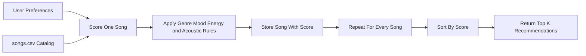

# 🎵 Music Recommender Simulation

## Project Summary

In this project you will build and explain a small music recommender system.

Your goal is to:

- Represent songs and a user "taste profile" as data
- Design a scoring rule that turns that data into recommendations
- Evaluate what your system gets right and wrong
- Reflect on how this mirrors real world AI recommenders

My version expands the starter catalog from 10 songs to 18 songs and plans a transparent content-based recommender. It will compare each song's genre, mood, energy, and acousticness to one user taste profile, assign a score, and rank the strongest matches at the top.

---

## How The System Works

Real-world recommendation systems often combine user behavior with item features, but this simulator focuses on the item side only. I expanded `data/songs.csv` to include more genres and moods, including hip hop, classical, country, EDM, folk, R&B, Latin, and metal, so the catalog has a wider range of vibes to compare. The dataset already includes the extra numeric features `danceability` and `acousticness`, which gives the simulation more depth even though the first scoring version will use the most interpretable signals.

Features used in each `Song`:

- `genre`
- `mood`
- `energy`
- `tempo_bpm`
- `valence`
- `danceability`
- `acousticness`

Information stored in `UserProfile`:

- `favorite_genre`
- `favorite_mood`
- `target_energy`
- `likes_acoustic`

Example user profile:

```python
user_profile = {
    "favorite_genre": "lofi",
    "favorite_mood": "focused",
    "target_energy": 0.40,
    "likes_acoustic": True,
}
```

This profile should be specific enough to separate "intense rock" from "chill lofi" because it combines a genre preference, a mood preference, an energy target, and a simple acoustic preference.

Algorithm Recipe:

1. Start every song at a score of `0.0`.
2. Add `+2.0` points if the song's `genre` matches the user's `favorite_genre`.
3. Add `+1.5` points if the song's `mood` matches the user's `favorite_mood`.
4. Add up to `+2.0` points for energy closeness using `2.0 * (1 - abs(song.energy - user.target_energy))`.
5. Add `+0.5` points if the user's acoustic preference matches the song:
   if `likes_acoustic` is `True`, reward songs with higher `acousticness`; if it is `False`, reward songs with lower `acousticness`.
6. Rank all songs by total score from highest to lowest and return the top `k`.

This recipe keeps genre slightly more important than mood for musical identity, while energy closeness keeps the results from feeling too broad. Ranking matters because the system must score one song at a time and then sort the full list to decide which recommendations come first.



Potential bias note: this system might over-prioritize genre labels and miss great songs from a different genre that still match the same mood or energy. Because the catalog is small and the labels are hand-written, the recommendations will also reflect the assumptions and tastes of whoever created the dataset.

Example CLI output for the default `pop/happy` profile:


---

## Getting Started

### Setup

1. Create a virtual environment (optional but recommended):

   ```bash
   python -m venv .venv
   source .venv/bin/activate      # Mac or Linux
   .venv\Scripts\activate         # Windows

2. Install dependencies

```bash
pip install -r requirements.txt
```

3. Run the app:

```bash
python -m src.main
```

### Running Tests

Run the starter tests with:

```bash
pytest
```

You can add more tests in `tests/test_recommender.py`.

---

## Experiments You Tried

I stress-tested the recommender with four profiles: `High-Energy Pop`, `Chill Lofi`, `Deep Intense Rock`, and a `Conflicted Edge Case` that asked for classical music, intense mood, very high energy, and acoustic texture all at once. The first three profiles mostly matched my musical intuition. For example, `Library Rain` and `Midnight Coding` felt like strong top picks for the chill lofi profile because they match both the labels and the softer energy target.

One useful surprise was how often `Gym Hero` stayed near the top. It ranks well for intense listeners because it is very high energy and has an `intense` mood, even though it is labeled `pop`. That makes sense mathematically, but it also shows that the system can prefer a strong energy match over a more specific genre identity.

I also ran a weight-shift experiment where I halved the genre weight and doubled the energy weight. That moved `Rooftop Lights` above `Gym Hero` for the high-energy pop profile. The result felt a little closer to a bright, upbeat "happy pop" vibe, but it also made the recommender less loyal to the user's exact genre label.

### High-Energy Pop


### Chill Lofi


### Deep Intense Rock


### Conflicted Edge Case


### Energy-Heavy Experiment


---

## Limitations and Risks

This recommender still works on a tiny, hand-built catalog, so it can only be as good as the labels and examples in `songs.csv`. It also treats genre labels as exact matches, which means a song tagged `indie pop` is not counted as a `pop` match even if it feels close to the same audience. The evaluation runs also showed that high-energy songs can rise too easily when a profile is contradictory, so the system can accidentally favor intensity over the user's broader vibe.

---

## Reflection

My biggest takeaway is that recommenders do not really "understand" songs the way people do. They turn a small set of labels and numbers into a score, and that score can look smart when the user profile is simple, but it can also break down fast when the preferences are mixed or contradictory. Seeing `Gym Hero` show up for both happy-pop and intense-rock listeners made it clear that a few heavily weighted features can shape a lot of the final ranking.

I also learned how easily bias can show up in a system that looks neutral on the surface. Exact genre matching treats `pop` and `indie pop` as completely different, while the energy score gives every song a chance to compete even if its overall vibe is wrong. With a small hand-built catalog like this one, the recommendations reflect the dataset designer's assumptions just as much as the user's taste.


---

## 7. `model_card_template.md`

Combines reflection and model card framing from the Module 3 guidance. :contentReference[oaicite:2]{index=2}  

```markdown
# 🎧 Model Card - Music Recommender Simulation

## 1. Model Name

Give your recommender a name, for example:

> VibeFinder 1.0

---

## 2. Intended Use

- What is this system trying to do
- Who is it for

Example:

> This model suggests 3 to 5 songs from a small catalog based on a user's preferred genre, mood, and energy level. It is for classroom exploration only, not for real users.

---

## 3. How It Works (Short Explanation)

Describe your scoring logic in plain language.

- What features of each song does it consider
- What information about the user does it use
- How does it turn those into a number

Try to avoid code in this section, treat it like an explanation to a non programmer.

---

## 4. Data

Describe your dataset.

- How many songs are in `data/songs.csv`
- Did you add or remove any songs
- What kinds of genres or moods are represented
- Whose taste does this data mostly reflect

---

## 5. Strengths

Where does your recommender work well

You can think about:
- Situations where the top results "felt right"
- Particular user profiles it served well
- Simplicity or transparency benefits

---

## 6. Limitations and Bias

Where does your recommender struggle

Some prompts:
- Does it ignore some genres or moods
- Does it treat all users as if they have the same taste shape
- Is it biased toward high energy or one genre by default
- How could this be unfair if used in a real product

---

## 7. Evaluation

How did you check your system

Examples:
- You tried multiple user profiles and wrote down whether the results matched your expectations
- You compared your simulation to what a real app like Spotify or YouTube tends to recommend
- You wrote tests for your scoring logic

You do not need a numeric metric, but if you used one, explain what it measures.

---

## 8. Future Work

If you had more time, how would you improve this recommender

Examples:

- Add support for multiple users and "group vibe" recommendations
- Balance diversity of songs instead of always picking the closest match
- Use more features, like tempo ranges or lyric themes

---

## 9. Personal Reflection

A few sentences about what you learned:

- What surprised you about how your system behaved
- How did building this change how you think about real music recommenders
- Where do you think human judgment still matters, even if the model seems "smart"
