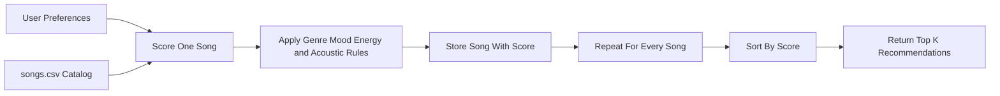
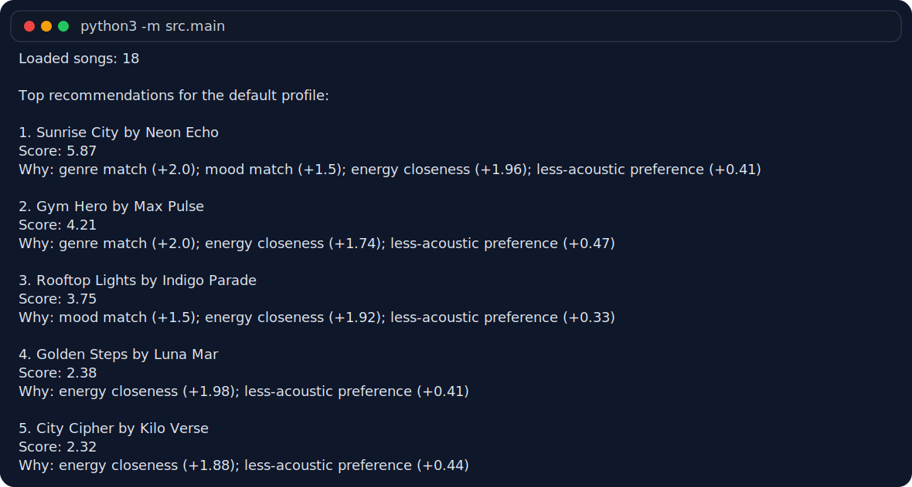
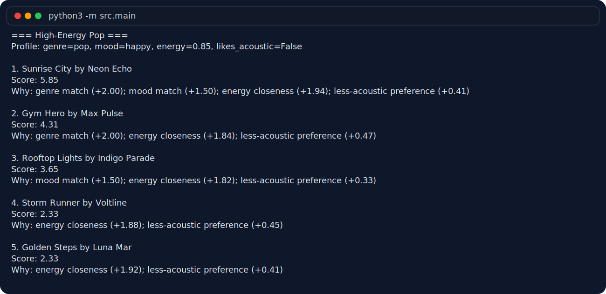
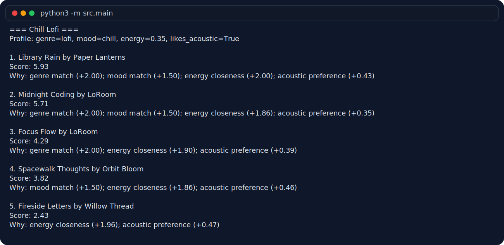
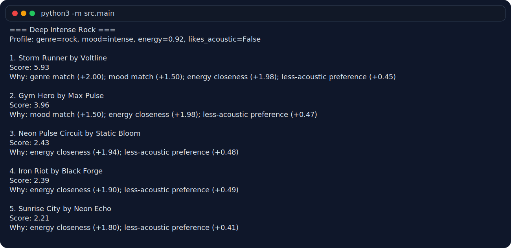
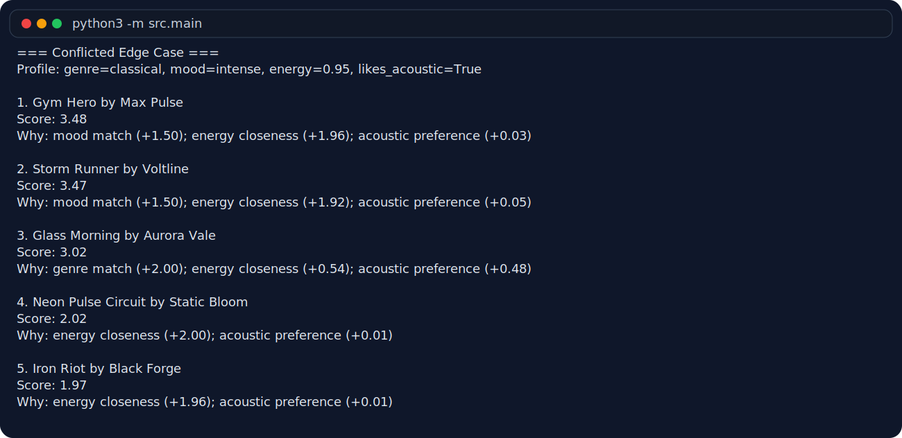
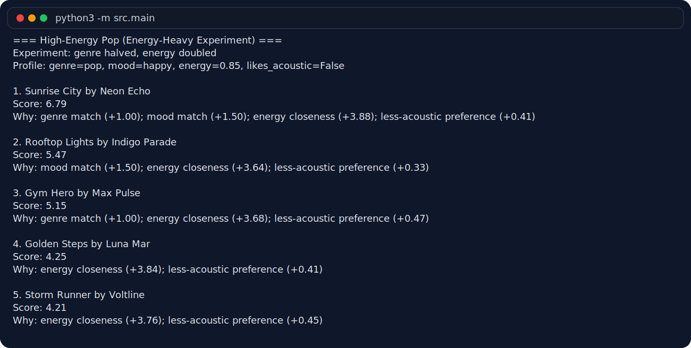

# 🎵 Music Recommender Simulation

## Project Summary

In this project you will build and explain a small music recommender system.

Your goal is to:

- Represent songs and a user "taste profile" as data
- Design a scoring rule that turns that data into recommendations
- Evaluate what your system gets right and wrong
- Reflect on how this mirrors real world AI recommenders

My version expands the starter catalog from 10 songs to 18 songs and implements a transparent content-based recommender. It compares each song to a user taste profile, scores both baseline and advanced attributes, supports multiple ranking modes, and reranks the final list for better diversity.

---

## Challenge Upgrades

The current implementation now goes beyond the starter recommender in four important ways:

- `data/songs.csv` includes 7 advanced attributes beyond the baseline fields:
  `popularity`, `release_decade`, `mood_tags`, `instrumentalness`, `live_energy`, `lyrical_density`, and `era_affinity`
- `src/recommender.py` uses math-based scoring rules for those features, including:
  `popularity fit = weight * (1 - abs(song.popularity - target_popularity) / 100)`
- release decade scoring rewards exact decade matches, gives a smaller bonus to neighboring decades, and still grants a tiny fallback score for out-of-era songs
- mood tags reward overlap with the user's mood plus mode-specific bonus tags such as `nostalgic`, `party`, `focused`, or `euphoric`
- three switchable ranking modes are included in addition to the default:
  `genre_first`, `mood_first`, and `energy_focused`
- a diversity-aware reranker subtracts penalties when the top list starts repeating the same artist or genre too often
- `src/main.py` prints a readable ASCII table with the final score and the reasons behind each recommendation

Useful commands:

```bash
python -m src.main
python -m src.main genre_first
python -m src.main mood_first
python -m src.main energy_focused
python -m src.main all
python -m src.main balanced --no-diversity
```

---

## How The System Works

Real-world recommendation systems often combine user behavior with item features, but this simulator focuses on the item side only. I expanded `data/songs.csv` to include more genres and moods, including hip hop, classical, country, EDM, folk, R&B, Latin, and metal, so the catalog has a wider range of vibes to compare. The current recommender uses both the original numeric fields and the newer advanced fields so different scoring modes can emphasize era, popularity, instrumentation, live feel, or detailed mood tags.

Features used in each `Song`:

- `genre`
- `mood`
- `energy`
- `tempo_bpm`
- `valence`
- `danceability`
- `acousticness`

Information stored in `UserProfile`:

- `favorite_genre`
- `favorite_mood`
- `target_energy`
- `likes_acoustic`

Example user profile:

```python
user_profile = {
    "favorite_genre": "lofi",
    "favorite_mood": "focused",
    "target_energy": 0.40,
    "likes_acoustic": True,
}
```

This profile should be specific enough to separate "intense rock" from "chill lofi" because it combines a genre preference, a mood preference, an energy target, and a simple acoustic preference.

Core Scoring Recipe:

1. Start every song at a score of `0.0`.
2. Add `+2.0` points if the song's `genre` matches the user's `favorite_genre`.
3. Add `+1.5` points if the song's `mood` matches the user's `favorite_mood`.
4. Add up to `+2.0` points for energy closeness using `2.0 * (1 - abs(song.energy - user.target_energy))`.
5. Add `+0.5` points if the user's acoustic preference matches the song:
   if `likes_acoustic` is `True`, reward songs with higher `acousticness`; if it is `False`, reward songs with lower `acousticness`.
6. Add mode-specific bonuses for advanced features such as popularity fit, release decade, mood tag overlap, instrumentalness, live energy, lyrical density, and era affinity.
7. If diversity mode is on, reduce the score of songs whose artist or genre already appears in the selected top results.
8. Rank all songs by total score from highest to lowest and return the top `k`.

This recipe keeps the simple content-based logic understandable while still making room for richer behavior. The different modes mainly change the weights and targets for those advanced signals, which lets the same catalog behave more like a genre-first, mood-first, or energy-first recommender.



Potential bias note: this system might over-prioritize genre labels and miss great songs from a different genre that still match the same mood or energy. Because the catalog is small and the labels are hand-written, the recommendations will also reflect the assumptions and tastes of whoever created the dataset.

Example CLI output for the default `pop/happy` profile:



---

## Getting Started

### Setup

1. Create a virtual environment (optional but recommended):

   ```bash
   python -m venv .venv
   source .venv/bin/activate      # Mac or Linux
   .venv\Scripts\activate         # Windows

2. Install dependencies

```bash
pip install -r requirements.txt
```

3. Run the app:

```bash
python -m src.main
```

### Running Tests

Run the starter tests with:

```bash
pytest
```

You can add more tests in `tests/test_recommender.py`.

---

## AI Prompt Pack

These prompts match the implementation in this repo and can be reused as evidence of the AI-assisted workflow for the four challenge tasks.

### Agent Mode Prompt for Challenge 1

```text
Open #file:data/songs.csv and #file:src/recommender.py.
Expand the dataset with at least 5 advanced song attributes that are not in the baseline starter data. Use fields like popularity (0-100), release_decade, detailed mood_tags, instrumentalness, live_energy, and lyrical_density.

Then update the scoring logic so each new attribute contributes through explicit math-based rules, not vague heuristics. Examples:
- popularity fit = weight * (1 - abs(song.popularity - target_popularity) / 100)
- decade bonus = full weight for preferred decades, partial weight for neighboring decades
- mood tag bonus = reward overlap between song tags and preferred tags like nostalgic, euphoric, aggressive, focused

Keep the code modular, return human-readable reasons for each score contribution, and make sure the recommender still returns the top-k ranked songs.
```

### Copilot Chat Prompt for Challenge 2

```text
Using #file:src/recommender.py, help me refactor this recommender so users can switch between multiple scoring modes from main.py.
I want at least these modes: balanced, genre_first, mood_first, and energy_focused.

Please suggest a simple Strategy-pattern-style design that keeps each mode modular without overengineering the project. I need:
- a clean place to store each mode's weights and target values
- a mode normalization helper
- a way for main.py to expose the available modes
- minimal code duplication in score_song and recommend_songs
```

### Inline Chat Prompt for Challenge 3

```text
Add a diversity penalty during reranking.
After the highest-scoring song is chosen, penalize later songs if their artist already appears in the selected recommendations list. Also add a smaller penalty for repeated genres.

Please implement this as a score adjustment such as:
- adjusted_score = base_score - (artist_penalty * repeated_artist_count) - (genre_penalty * repeated_genre_count)

Keep the original score explanation, append the penalty reasons, and make sure the final top-k list spreads out repeated artists when possible.
```

### Copilot Chat Prompt for Challenge 4

```text
Using #file:src/main.py, suggest a clean way to print the top recommendations as a terminal table.
You can use tabulate or simple ASCII formatting, but the output must include:
- rank
- song title
- artist
- genre
- final score
- reasons for the score

Please keep long reason strings readable by wrapping them across multiple lines instead of truncating them.
```

---

## Experiments You Tried

I stress-tested the recommender with four profiles: `High-Energy Pop`, `Chill Lofi`, `Deep Intense Rock`, and a `Conflicted Edge Case` that asked for classical music, intense mood, very high energy, and acoustic texture all at once. The first three profiles mostly matched my musical intuition. For example, `Library Rain` and `Midnight Coding` felt like strong top picks for the chill lofi profile because they match both the labels and the softer energy target.

One useful surprise was how often `Gym Hero` stayed near the top. It ranks well for intense listeners because it is very high energy and has an `intense` mood, even though it is labeled `pop`. That makes sense mathematically, but it also shows that the system can prefer a strong energy match over a more specific genre identity.

I also ran a weight-shift experiment where I halved the genre weight and doubled the energy weight. That moved `Rooftop Lights` above `Gym Hero` for the high-energy pop profile. The result felt a little closer to a bright, upbeat "happy pop" vibe, but it also made the recommender less loyal to the user's exact genre label.

### High-Energy Pop



### Chill Lofi



### Deep Intense Rock



### Conflicted Edge Case



### Energy-Heavy Experiment



---

## Limitations and Risks

This recommender still works on a tiny, hand-built catalog, so it can only be as good as the labels and examples in `songs.csv`. It also treats genre labels as exact matches, which means a song tagged `indie pop` is not counted as a `pop` match even if it feels close to the same audience. The evaluation runs also showed that high-energy songs can rise too easily when a profile is contradictory, so the system can accidentally favor intensity over the user's broader vibe.

---

## Reflection

My biggest takeaway is that recommenders do not really "understand" songs the way people do. They turn a small set of labels and numbers into a score, and that score can look smart when the user profile is simple, but it can also break down fast when the preferences are mixed or contradictory. Seeing `Gym Hero` show up for both happy-pop and intense-rock listeners made it clear that a few heavily weighted features can shape a lot of the final ranking.

I also learned how easily bias can show up in a system that looks neutral on the surface. Exact genre matching treats `pop` and `indie pop` as completely different, while the energy score gives every song a chance to compete even if its overall vibe is wrong. With a small hand-built catalog like this one, the recommendations reflect the dataset designer's assumptions just as much as the user's taste.


---

## 7. `model_card_template.md`

Combines reflection and model card framing from the Module 3 guidance. :contentReference[oaicite:2]{index=2}  

```markdown
# 🎧 Model Card - Music Recommender Simulation

## 1. Model Name

Give your recommender a name, for example:

> VibeFinder 1.0

---

## 2. Intended Use

- What is this system trying to do
- Who is it for

Example:

> This model suggests 3 to 5 songs from a small catalog based on a user's preferred genre, mood, and energy level. It is for classroom exploration only, not for real users.

---

## 3. How It Works (Short Explanation)

Describe your scoring logic in plain language.

- What features of each song does it consider
- What information about the user does it use
- How does it turn those into a number

Try to avoid code in this section, treat it like an explanation to a non programmer.

---

## 4. Data

Describe your dataset.

- How many songs are in `data/songs.csv`
- Did you add or remove any songs
- What kinds of genres or moods are represented
- Whose taste does this data mostly reflect

---

## 5. Strengths

Where does your recommender work well

You can think about:
- Situations where the top results "felt right"
- Particular user profiles it served well
- Simplicity or transparency benefits

---

## 6. Limitations and Bias

Where does your recommender struggle

Some prompts:
- Does it ignore some genres or moods
- Does it treat all users as if they have the same taste shape
- Is it biased toward high energy or one genre by default
- How could this be unfair if used in a real product

---

## 7. Evaluation

How did you check your system

Examples:
- You tried multiple user profiles and wrote down whether the results matched your expectations
- You compared your simulation to what a real app like Spotify or YouTube tends to recommend
- You wrote tests for your scoring logic

You do not need a numeric metric, but if you used one, explain what it measures.

---

## 8. Future Work

If you had more time, how would you improve this recommender

Examples:

- Add support for multiple users and "group vibe" recommendations
- Balance diversity of songs instead of always picking the closest match
- Use more features, like tempo ranges or lyric themes

---

## 9. Personal Reflection

A few sentences about what you learned:

- What surprised you about how your system behaved
- How did building this change how you think about real music recommenders
- Where do you think human judgment still matters, even if the model seems "smart"
